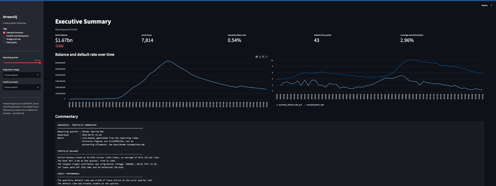

# ArrearsIQ

**Credit portfolio monitoring and risk analytics on a real loan-level panel.**

A reporting pipeline over 50,000 US residential mortgages observed quarterly
from 2000 to 2015 — through the housing boom, the crash, and the recovery. It
builds a star schema in DuckDB, computes every metric in versioned SQL, and
surfaces portfolio size, delinquency, roll rates, vintage curves and default
exposure by segment.

> **Status:** complete. Ingestion and star schema, eight reporting views,
> IFRS 9 staging and illustrative provisioning, a ten-rule data quality
> framework, rule-based commentary, a four-page Streamlit dashboard, Power BI
> export and full documentation.



*Executive Summary at 2015Q1. The balance chart traces the book through the
2006 peak and the run-off that followed; the right-hand chart plots quarterly
default rate against unemployment. The commentary panel below is generated by
rule, not by a language model — every sentence is a template filled from a
value in a SQL view.*

## Why this dataset

The performance file is a genuine monthly panel — one row per loan per period.
Roll rates and vintage analysis are impossible without one, and no snapshot
dataset (Lending Club and friends) can supply it. This is real observed
behaviour, not generated data, so there is no honesty caveat to write.

## Data source and attribution

Built on the **`mortgage` panel dataset**, companion data to *Credit Risk
Analytics: Measurement Techniques, Applications, and Examples in SAS* by Bart
Baesens, Daniel Roesch and Harald Scheule (John Wiley & Sons, 2016), originally
provided by **International Financial Research**. A randomised selection of
loan-level data from US residential mortgage-backed securities portfolios.

All data originates with those authors and International Financial Research.
This project claims no ownership of it and redistributes none of it. The
authors are not affiliated with this project and do not endorse it. Any errors
in derivation, banding or interpretation here are mine, not theirs.

| Source | Used for |
|---|---|
| [creditriskanalytics.net](http://www.creditriskanalytics.net/datasets-downloads.html) | The dataset (`mortgage_csv.rar`) |
| *Credit Risk Analytics* (Wiley, 2016) | Column definitions |
| US Bureau of Labor Statistics unemployment series | Independent check used to recover the calendar |

`data/` is gitignored. The file is freely downloadable, so this is not a hard
legal restriction, but it is third-party companion data to a copyrighted
textbook with no stated redistribution licence. The repo stays reproducible
from instructions rather than by carrying someone else's data.

## Running it

```bash
python3 -m venv .venv && source .venv/bin/activate
pip install -r requirements.txt

# Download the data first -- see DATA.md
python src/ingest.py       # build the star schema
python src/views.py        # create the eight reporting views
python src/quality.py      # run the ten data quality rules
python src/commentary.py   # write commentary for the latest quarter
python export.py           # refresh the Power BI CSVs
streamlit run app.py       # serve the dashboard
```

Order matters: views read the tables ingest builds, the quality rules reconcile
two of the views against each other, and the commentary reports the current
failing rules. See [docs/Monthly Reporting Process.md](docs/Monthly%20Reporting%20Process.md).

## The star schema

| Table | Grain | Rows |
|---|---|---|
| `dim_loan` | one row per loan | 50,000 |
| `fact_loan_quarter` | one row per loan per quarter | 623,732 |
| `fact_credit_event` | one row per defaulted loan | 15,154 |
| `dim_date` | one row per period | 60 |
| `dq_results` | data quality register, appended per run | — |

**The grain is quarterly, not monthly.** A 30-year loan shows
`mat_time - orig_time = 120` — 120 quarters. The fact table is named
`fact_loan_quarter` rather than `fact_loan_month` so the grain cannot be
misread.

## The six reporting views

Every metric is computed in a `.sql` file under `sql/`, never in Pandas. Each
opens with the business question it answers.

| View | Answers |
|---|---|
| `vw_portfolio_summary` | Balance, active loans, average balance, quarter-over-quarter growth, defaults and payoffs |
| `vw_segment_performance` | The same, cut by credit score band, LTV band, property type, occupancy and vintage |
| `vw_delinquency` | Status distribution and default rate, by quarter and segment |
| `vw_roll_rates` | Status at quarter *t* against *t+1*, balance moved, roll rate |
| `vw_vintage_performance` | Cumulative default rate by cohort, indexed on quarters on book |
| `vw_loss_recovery` | Default counts, exposure at default and LTV at default by segment |
| `vw_provision` | IFRS 9 stage, exposure, observed PD, provision and coverage ratio |
| `vw_provision_movement` | Opening, increase, decrease, closing provision, with the reconciliation carried as a column |

## Recovering the calendar

The dataset's `time` column is deliberately deidentified — an integer 1..60 with
no stated calendar meaning. The embedded unemployment and house price series
anchor it:

| Period | Dataset UER | Implied quarter | Actual US UER |
|---|---|---|---|
| 1 | 3.8 | 2000Q2 | 3.9 |
| 14 | 6.2 | 2003Q3 | 6.1 |
| 25 | 4.7 (HPI peaks) | 2006Q2 | 4.6 |
| 39 | 10.0 (UER peaks) | 2009Q4 | 9.9 |
| 60 | 5.7 | 2015Q1 | 5.6 |

**This is a derived inference, not a stated fact.** It is used only for
labelling — every metric is computed on the raw integer period — and
`CALENDAR_ANCHOR = None` in `src/config.py` removes it without changing a
single number.

## What the two cohorts show

Cohorts were chosen from the data, not assumed: lifetime default rate rises
monotonically across origination quarters from 9.3% to 53.2%.

| | 2003Q3 | 2006Q4 |
|---|---|---|
| Loans | 1,427 | 3,822 |
| Avg credit score at origination | 674 | 660 |
| Avg LTV at origination | 79.7 | 80.1 |
| **Lifetime default rate** | **9.3%** | **53.2%** |
| Avg LTV **at default** | 66.1 | 106.7 |
| Avg quarters on book at default | 16.4 | 10.5 |

Interpretation is deliberately left to `docs/Business Insights.md`, which is
filled in after reviewing the analysis rather than written ahead of it.

## What this dataset cannot support

Recorded because it changes what the project can honestly report:

- **No delinquency buckets.** No days-past-due field; a loan is only active,
  defaulted or paid off. Roll rates are status transitions, and because default
  and payoff are terminal there are **no cures** to observe.
- **No recovery, expense or realised-loss amounts.** Loss severity (loss given
  default) cannot be computed and is absent rather than guessed. Exposure at
  default and LTV at default are reported instead.
- **No property state, loan purpose, channel or DTI.** Segmentation is credit
  score band, LTV band, property type and occupancy.
- **Cohorts season to different horizons.** 2006Q4 can be followed to 36
  quarters on book, 2003Q3 to 46. `vw_vintage_performance` carries
  `loans_observed` and `pct_cohort_still_observed` on every row so curves are
  only compared where both cohorts are fully seasoned.

## Data quality

Defects found in the source are reported, never silently cleaned. `dq_results`
records every finding with a run timestamp, severity and row count.

| Finding | Severity | Rows | Handling |
|---|---|---|---|
| Duplicate loan-periods (27 with conflicting balances) | HIGH | 339 | One row kept per loan-period, lower balance |
| Missing mid-panel periods | MEDIUM | 1,582 | Forward-filled, every row flagged `is_forward_filled` |
| Inconsistent origination attributes | MEDIUM | 439 loans | Value at the loan's earliest period used, so builds are reproducible |
| Balance rising on a repaying loan | MEDIUM | 21,290 | **Left failing** — negative amortisation, real product behaviour |
| Property type not stated | LOW | 9,818 | **Left failing** — a real 'not stated' category |

Current Data Quality Score: **87.5 / 100**, 8 of 10 rules passing. The pipeline
is deterministic: two consecutive rebuilds produce identical tables.

Forward-filled rows synthesise observations that were never reported, so they
carry a flag and are excluded from roll rates entirely. Macro variables are
never carried forward — they belong to the period, not the loan.

## Mapping to the job posting

| Posting requirement | Where this project answers it |
|---|---|
| Dashboards monitoring credit portfolio performance | Four-page Streamlit dashboard, quarterly trend views *(Phase 6)* |
| Analysis of portfolio performance indicators | Default rate, exposure at default, LTV at default, coverage ratio by segment |
| Interpret data, explain discrepancies, assess implications | Monthly commentary with segment contribution attribution *(Phase 5)*, Business Insights |
| Data quality analysis with governance teams | Validation rules, issue register, data quality score, reconciliation *(Phase 4)* |
| Migration of publications to a new data model | Star schema built from a raw flat source file |
| SQL | Six reporting views using CTEs and window functions (`LAG`, running sums, partitioned shares) |
| Power BI and Tableau | Power BI dashboard from exported marts *(Phase 6)* |

## Dashboard

Four pages via the sidebar: Executive Summary, Portfolio and Delinquency,
Vintage and Loss, Data Quality. Slicers on reporting quarter, origination
vintage and credit score band.

```bash
streamlit run app.py
```

Screenshot of the Executive Summary page is at the top of this README.

The dashboard queries and lays out — it does not calculate. Every figure comes
from a SQL view, and the connection is opened read-only so the app cannot mutate
the warehouse. Limitations are stated in the UI rather than hidden from it.

## Deploying to Streamlit Community Cloud

The app needs `data/arrearsiq.duckdb`, which is gitignored and not
redistributable, so the deployment cannot simply clone and run.

1. Push the repo to GitHub (already done — the data stays out of it).
2. At [share.streamlit.io](https://share.streamlit.io) create an app pointing at
   this repo, branch `main`, main file `app.py`.
3. **Supply the warehouse.** Either add a first-run step that downloads
   `mortgage.csv` and calls `src/ingest.py` and `src/views.py`, or attach the
   prebuilt `.duckdb` file through a storage bucket the app can reach. Do not
   commit either to the repo.
4. `requirements.txt` is picked up automatically. Set the Python version under
   *Advanced settings* if you need to pin it.

Without step 3 the app starts and shows its "no database found" message rather
than crashing, which is deliberate.

## Documentation

| Document | Covers |
|---|---|
| [Business Problem](docs/Business%20Problem.md) | What portfolio monitoring answers, and why a panel is required |
| [KPI Definitions](docs/KPI%20Definitions.md) | Every metric, its formula and its source view |
| [Data Dictionary](docs/Data%20Dictionary.md) | Every table and column, generated from the live schema |
| [SQL Logic](docs/SQL%20Logic.md) | View-by-view techniques and validation |
| [Data Quality Rules](docs/Data%20Quality%20Rules.md) | The ten rules, scoring, and findings on the real data |
| [Monthly Reporting Process](docs/Monthly%20Reporting%20Process.md) | The run order, and how to read the output |
| [Known Assumptions](docs/Known%20Assumptions.md) | Every choice that affects a number |
| [Business Insights](docs/Business%20Insights.md) | Template — findings to be written after reviewing the analysis |
| [DATA.md](DATA.md) | How to obtain the data |

`notebooks/01_exploration.ipynb` profiles the raw file — shape, dtypes, missing
values, status distribution, and the two defects that profiling turned up. It
shows working; it is not part of the pipeline.

## Licence

Project code: Apache License 2.0, see [LICENSE](LICENSE). The dataset it reads
is governed by its authors' terms and is not covered by this licence.
