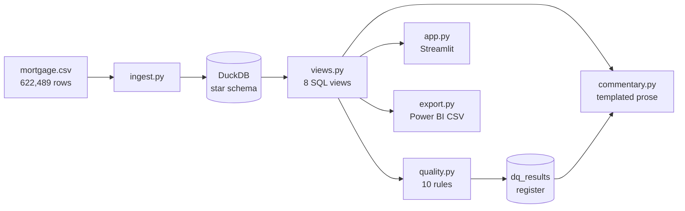

```
██████   ██████  ██████  ████████ ███████  ██████  ██      ██  ██████
██   ██ ██    ██ ██   ██    ██    ██      ██    ██ ██      ██ ██    ██
██████  ██    ██ ██████     ██    █████   ██    ██ ██      ██ ██    ██
██      ██    ██ ██   ██    ██    ██      ██    ██ ██      ██ ██    ██
██       ██████  ██   ██    ██    ██       ██████  ███████ ██  ██████

██████  ██    ██ ██      ███████ ███████
██   ██ ██    ██ ██      ██      ██
██████  ██    ██ ██      ███████ █████
██      ██    ██ ██           ██ ██
██       ██████  ███████ ███████ ███████
```

**Credit portfolio monitoring on a real loan-level panel. Every metric in SQL, every assumption written down.**


## The thirty-second pitch

Point Portfolio Pulse at a loan-level panel and it produces the reporting a
credit portfolio review actually needs: balance and growth by segment,
delinquency and roll rates, vintage curves indexed on months on book, IFRS 9
staging and provision movement, a ten-rule data quality register, and written
commentary naming the segment that moved the number.

It runs on 50,000 US residential mortgages observed quarterly from 2000 to 2015
— through the housing boom, the crash and the recovery. Real observed behaviour,
not generated data, so there is no honesty caveat in this README about patterns
that were synthesised.

Every metric is computed in a `.sql` file. Nothing is calculated in Pandas, and
nothing is calculated in the dashboard. If a number looks wrong, there is
exactly one place to look.

## How it works



Order matters. Views read the tables ingest builds, the quality rules reconcile
two of the views against each other, and the commentary reports whichever rules
are currently failing.

## Mental models

> **New to portfolio monitoring?** The whole discipline is about *change*, not
> *state*. A snapshot tells you how many loans are bad today. A panel tells you
> how they got there — and that is the only thing you can act on.

**A panel, not a snapshot.** One row per loan per period. Roll rates need a
loan's state in consecutive periods, vintage curves need each cohort tracked
from origination, provision movement needs an opening and closing position.
None of that survives a dataset with one row per loan.

**Cohorts are compared at equal age, never equal date.** A 2011 vintage will
always look better than a 2006 one on a calendar chart, because it has had less
time to fail. Indexing on quarters on book removes that illusion.

**Findings are reported, never silently cleaned.** A failing quality rule is a
question. One of the two currently failing on this data turned out not to be a
defect at all.

## Install

Requires Python 3.11 or newer.

```bash
git clone git@github.com:jeremymadonna/PortfolioPulse.git
cd PortfolioPulse
python3 -m venv .venv && source .venv/bin/activate
pip install -r requirements.txt
```

The data is not in this repository — see [DATA.md](DATA.md). One command:

```bash
cd data
curl -O http://www.creditriskanalytics.net/uploads/1/9/5/1/19511601/mortgage_csv.rar
bsdtar -xvf mortgage_csv.rar && rm mortgage_csv.rar
```

## The sixty-second run

```console
$ python src/ingest.py
  schema check: mortgage.csv
    622,489 rows, 50,000 loans, periods 1..60
    status_time not in (0,1,2)     0  ok
    FICO outside 300-900           0  ok
    negative balance               0  ok

--- row counts ---
  dim_loan                   50,000
  fact_loan_quarter         623,732
  fact_credit_event          15,154
  dim_date                       60

--- the two focus cohorts ---
   focus_cohort origination_vintage  loans  avg_fico  avg_ltv  lifetime_default_pct
  Benign cohort              2003Q3   1427     674.0     79.7                   9.3
Stressed cohort              2006Q4   3822     660.0     80.1                  53.2
```

```console
$ python src/views.py
  vw_portfolio_summary                 60 rows
  vw_segment_performance            4,146 rows
  vw_delinquency                    7,961 rows
  vw_roll_rates                       177 rows
  vw_vintage_performance            1,634 rows
  vw_loss_recovery                     81 rows
  vw_provision                        879 rows
  vw_provision_movement                60 rows
```

Then `python src/quality.py`, `python src/commentary.py`, `python export.py`,
and `streamlit run app.py`.

## The star schema

| Table | Grain | Rows |
|---|---|---|
| `dim_loan` | one row per loan | 50,000 |
| `fact_loan_quarter` | one row per loan per quarter | 623,732 |
| `fact_credit_event` | one row per defaulted loan | 15,154 |
| `dim_date` | one row per period | 60 |
| `dq_results` | data quality register, appended per run | — |

> **The grain is quarterly, not monthly.** A 30-year loan shows
> `mat_time - orig_time = 120` — 120 quarters. The fact table is named
> `fact_loan_quarter` so the grain cannot be misread.

## The eight views

Each file opens with the business question it answers.

| View | Answers |
|---|---|
| `vw_portfolio_summary` | Balance, active loans, growth, defaults and payoffs |
| `vw_segment_performance` | The same, cut by five risk dimensions |
| `vw_delinquency` | Status distribution and default rate by quarter and segment |
| `vw_roll_rates` | State at quarter *t* against *t+1*, balance moved, roll rate |
| `vw_vintage_performance` | Cumulative default by cohort, indexed on quarters on book |
| `vw_loss_recovery` | Default counts, exposure at default, LTV at default |
| `vw_provision` | IFRS 9 stage, observed PD, provision, coverage ratio |
| `vw_provision_movement` | Opening, increase, decrease, closing, with reconciliation |

Techniques: `LAG` for period-over-period movement, self-joins across consecutive
periods for transitions, running sums partitioned by cohort for vintage curves,
and nested aggregates over windows for within-segment shares.

## Recovering the calendar

The source's `time` column is deliberately deidentified — an integer 1..60 with
no stated calendar meaning. The embedded unemployment and house price series
anchor it:

| Period | Dataset UER | Implied quarter | Actual US UER |
|---|---|---|---|
| 1 | 3.8 | 2000Q2 | 3.9 |
| 14 | 6.2 | 2003Q3 | 6.1 |
| 25 | 4.7 (HPI peaks) | 2006Q2 | 4.6 |
| 39 | 10.0 (UER peaks) | 2009Q4 | 9.9 |
| 60 | 5.7 | 2015Q1 | 5.6 |

Five checkpoints agree within 0.1 percentage points.

> **This is a derived inference, not a stated fact.** It is used only for
> labelling — every metric is computed on the raw integer period. Setting
> `CALENDAR_ANCHOR = None` in `src/config.py` removes it without changing a
> single number.

## What the data showed

Two cohorts, near-identical at origination, ten times apart in outcome.

| | 2003Q3 | 2006Q4 |
|---|---|---|
| Loans | 1,427 | 3,822 |
| Avg credit score at origination | 674 | 660 |
| Avg LTV at origination | 79.7 | 80.1 |
| **Lifetime default rate** | **9.3%** | **53.2%** |
| Avg LTV **at default** | 66.1 | 106.7 |
| Share underwater at default | 0.0% | 65.4% |
| Median quarters to default | 14 | 9 |

The stressed cohort's *best* credit band defaulted at 31.7% — worse than the
benign cohort's *worst* band at 19.6%. Score still ranked risk; it stopped
protecting against the level.

Full write-up with the query behind every figure:
[docs/Business Insights.md](docs/Business%20Insights.md).

## Data quality: findings, not cleansing

```console
$ python src/quality.py
  RULE                                   SEVERITY RESULT     AFFECTED
  duplicate_loan_period                  HIGH     PASS              0
  negative_balance                       HIGH     PASS              0
  balance_increased_on_amortising_loan   MEDIUM   FAIL         21,290
  row_dated_before_origination           MEDIUM   PASS              0
  loan_left_terminal_status              HIGH     PASS              0
  missing_credit_score                   MEDIUM   PASS              0
  missing_property_type                  LOW      FAIL          9,818
  invalid_status_code                    HIGH     PASS              0
  segment_balance_reconciliation         HIGH     PASS              0
  reporting_period_continuity            MEDIUM   PASS              0
--------------------------------------------------------------------------
  Data Quality Score: 87.5 / 100   (8 of 10 rules passed)
```

The 21,290-row failure is the interesting one. Balances rising on a repaying
loan looks like a defect, but the rises are seventeen times more concentrated in
bubble-era originations — 6.7% of active rows in 2006+ vintages against 0.4% in
2000–2003, across 11.3% of the book. That is negative amortisation working as
designed, not a reporting error. Cleaning it would have deleted a real finding
about how those loans were written.

Three defects found at ingestion are corrected and logged rather than hidden:
339 duplicate loan-periods, 1,582 forward-filled gap rows (each flagged
`is_forward_filled`), and 439 loans whose origination attributes contradict
themselves across their own rows.

## The boundaries

What this dataset cannot support. Gaps, not omissions — a stand-in would be
worse than a hole.

| Not reported | Why |
|---|---|
| 30+ / 60+ / 90+ arrears rates | No days-past-due field exists. Only active, defaulted or paid off. |
| Loss severity, recoveries, net loss | No recovery, expense or realised-loss amounts. Exposure and LTV at default are reported instead. |
| Cure rates | Default and payoff are terminal, so roll rates show no backward moves. |
| Geography, purpose, channel | Not present in the source. |

## Dashboard

```bash
streamlit run app.py
```

Four pages: Executive Summary, Portfolio and Delinquency, Vintage and Loss,
Data Quality. Slicers on reporting quarter, origination vintage and credit score
band. The connection is read-only, so the app can never mutate the warehouse.

Limitations are stated in the UI rather than hidden from it — a reviewer should
not have to read DATA.md to learn what a chart cannot tell them.

### Deploying to Streamlit Community Cloud

The app needs `data/portfoliopulse.duckdb`, which is gitignored and not
redistributable, so a deployment cannot simply clone and run.

1. Create an app at [share.streamlit.io](https://share.streamlit.io) pointing at
   this repo, branch `main`, main file `app.py`.
2. Supply the warehouse: either add a first-run step that downloads the source
   and calls `src/ingest.py` and `src/views.py`, or attach a prebuilt `.duckdb`
   from a storage bucket. Do not commit either.

Without step 2 the app starts and shows its "no database found" message rather
than crashing. That is deliberate.

## Documentation

| Document | Covers |
|---|---|
| [Business Problem](docs/Business%20Problem.md) | What portfolio monitoring answers, and why a panel is required |
| [KPI Definitions](docs/KPI%20Definitions.md) | Every metric, its formula and its source view |
| [Data Dictionary](docs/Data%20Dictionary.md) | Every table and column, generated from the live schema |
| [SQL Logic](docs/SQL%20Logic.md) | View-by-view techniques and validation |
| [Data Quality Rules](docs/Data%20Quality%20Rules.md) | The ten rules, scoring, and findings |
| [Monthly Reporting Process](docs/Monthly%20Reporting%20Process.md) | Run order, and how to read the output |
| [Known Assumptions](docs/Known%20Assumptions.md) | Every choice that affects a number |
| [Business Insights](docs/Business%20Insights.md) | Five findings, each with its query |
| [DATA.md](DATA.md) | How to obtain the data |

`notebooks/01_exploration.ipynb` profiles the raw file in 27 cells. It shows
working; it is not part of the pipeline.

## Mapping to the job posting

| Posting requirement | Where this answers it |
|---|---|
| Dashboards monitoring credit portfolio performance | Four-page Streamlit dashboard, quarterly trend views |
| Analysis of portfolio performance indicators | Default rate, exposure at default, LTV at default, coverage ratio by segment |
| Interpret data, explain discrepancies, assess implications | Commentary with segment attribution, Business Insights |
| Data quality analysis with governance teams | Ten rules, issue register, weighted score, reconciliation |
| Migration of publications to a new data model | Star schema built from a raw flat source file |
| SQL | Eight views using CTEs and window functions |
| Power BI and Tableau | `export.py` writes flat marts to `powerbi/` |

## Guarantees and non-goals

**Guaranteed.** Every reporting metric lives in a `.sql` file. The build is
deterministic — two consecutive rebuilds produce identical tables and an
identical balance sum to the cent. Segment balances reconcile to the portfolio
total to 0.00 across all five dimensions. Provision movement reconciles to zero
error on every row. Roll rates sum to exactly 100% within every state and period.

**Non-goals.** No machine learning and no statistical modelling — nothing here
is fitted. Provisioning is illustrative, not an accounting allowance: PD is
observed from the panel, LGD is an assumed constant. The commentary is templated,
not generated by a language model, so every sentence can be traced to a query.
This is US mortgage data — the methodology transfers to a retail or card book,
the loss rates do not.

## Author

Jeremy Madonna — built as a portfolio project for a credit portfolio monitoring
and risk analytics role.

## License

Apache License 2.0, see [LICENSE](LICENSE). The dataset it reads is governed by
its authors' terms and is not covered by this licence. Data originates with
Baesens, Roesch & Scheule (*Credit Risk Analytics*, Wiley 2016) and
International Financial Research, who are not affiliated with this project.
